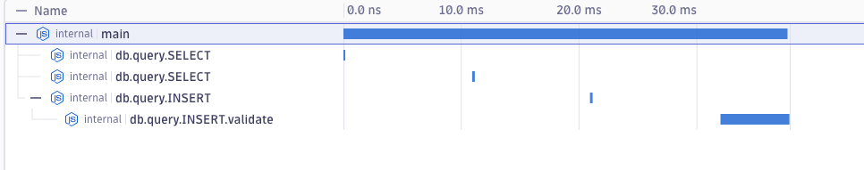

## Diagnostics Channel instrumentation example

This example demonstrates how to use OpenTelemetry to trace operations exposed via tracing channels in Node.js.

**Layout:**
  - `opentelemetry.ts` contains setup for OpenTelemetry tracing, as well as an OTLP exporter.
    - the later code pretends to be a instrumentation that subscribes to a tracing channel and generates spans based one the message.
    - it also uses the prototype `context.attach()` and `context.detach()` APIs to manage context propagation manually
      without having to expose `AsyncLocalStorage` as proposed in https://github.com/open-telemetry/opentelemetry-js/issues/6088
  - `index.ts` simulates being a library that exposes operations via `diagnostics_channel`, but also uses some
     OpenTelemetry instrumentation to demonstrate proper parenting of spans.

To run the example, execute:
- `npm run compile` (from top-level, important as context operations are not available otherwise)
- `npm run start` (you can set OTLP exporter env vars to point it to your backend of choice)

You should see spans being generated for both the library operations and the tracing channel operations, properly parented:

